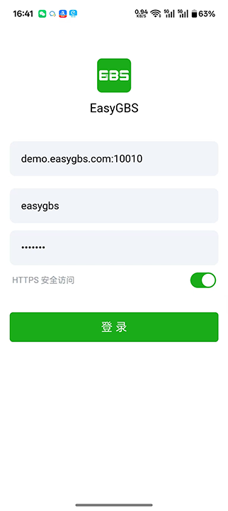
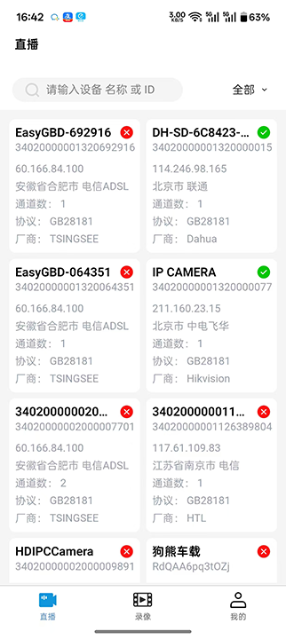
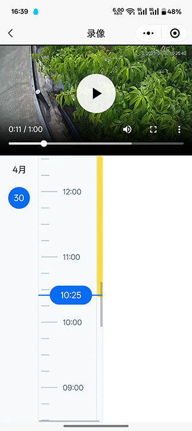

# EasyGBS APP

<p align="center">
  
</p>

EasyGBS 是一款支持国标GB/T28181及其他几种标准协议，平台支持海康、大华、宇视等各品牌IPC、NVR接入，并对接入的视频资源进行统一管理，视频能力可覆盖安防行业所有需求，提供 `实时监控` `云端录像` `AI视频分析` `告警上报` `语音对讲` `平台级联` 等功能的音视频流媒体聚合服务平台。

官网地址 [EasyGBS 官网](https://easygbs.com)

Server端下载地址  [EasyGBS Server下载地址](https://easygbs.com/docs/down/EasyGBS%E4%B8%8B%E8%BD%BD)

&nbsp;&nbsp;&nbsp;&nbsp;&nbsp;&nbsp;&nbsp;&nbsp;&nbsp;

<details>
  <summary style="color:blue">点击查看项目截图</summary>
  
  
  
    
</details>

# 功能

-  **私有化部署** 支持连接私有化部署的服务
- **直播**：支持直播预览，并支持操作云台（需摄像头支持）。
- **录像**：支持查看本地录像，支持选择日期，时间，可视化时间轴。
- **多用户**：支持多用户登录，可在服务端配置对应用户所拥有的通道。
- **小程序**：兼容小程序，代码层面兼容不同平台采用不同播放逻辑。

# 运行项目

```
git clone https://github.com/EasyGBS/EasyGBS_APP.git

// 安装依赖
npm i

// 使用HBuilderX 运行项目
运行 - 运行到手机或模拟器 - 运行到App基座

// 启用tailwind css （使用tailwindcss样式时运行）
npm run tailwind
```

### 目录

```
根目录
├─ main.js                        // 入口文件
├─ static
│  ├─ tailwind.css                // tailwind 生成后的文件
│  ├─ image
│  └─ icon
├─ service                        
│  ├─ utils                       // 公共工具
│  ├─ store                       // 状态管理，本地缓存函数
│  └─ http                        // 网络请求 API目录
├─ pages                          // 页面
├─ hybrid                         // webview模块（暂时弃用。参考uniapp web-view文档）
├─ doc                            // 存放文档
├─ constants                      // 共用产量
└─ components                     // 公共组件
```

## License

[MIT](https://github.com/LunaTechLab/MoonTV/blob/main/LICENSE) © 2025 EasyGBS APP

